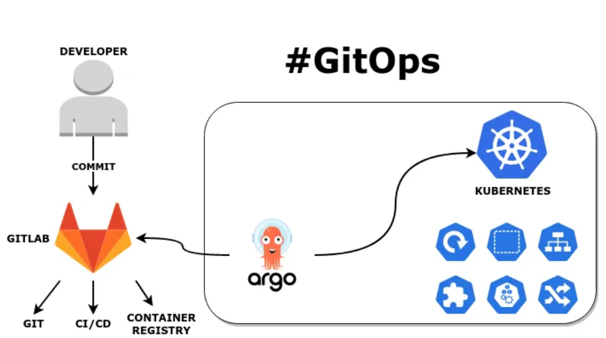
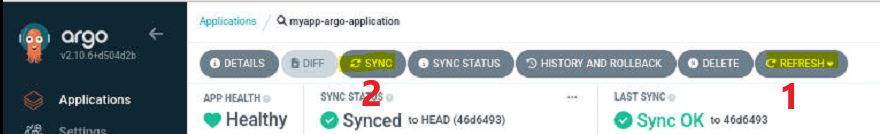
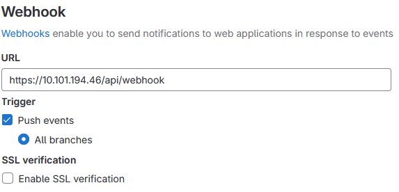
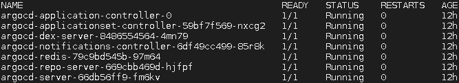

## Purpose

This is the Gitops Gitlab-ArgoCD pipeline demo.\
It demonstrates the automatic deployment of K8S manifest commits.

The Demo is composed of 2 sections

- Perodic polling of gitlab by ArgoCD \
  ArgoCD polls Gitlab every 3 minutes in order to detect any deviance.\
  In case of a difference is spotted, the new manifest is immediately applied.\
  Also it is possible to incite a manual process, rather than waiting 3 minutes.\
  You can initiate the manual process as below:
  

  

- Instant Deployment via Webhooks \
  ArgoCD webhook endpoint (/api/webhook) has to be publicly accessible to allow Gitlab to send it requests.\
  Setup the webhook at the gitlab, as below \

### ArgoCD Deployment Procedure

> kubectl create ns argocd
> kubectl apply -n argocd -f https://raw.githubusercontent.com/argoproj/argo-cd/stable/manifests/install.yaml

Check with 
> kubectl get pods -n argocd

### Demo

Clone the repo to your master node \
> kubectl apply -f dev/muzo.yaml \
> kubectl apply -f applications.yaml

# PS
Docker images are stored in my private Harbour registry, in my home lab env\
I'm going to push them to a public registry (Docker Hub) and tweak the manifest accordingly, soon \
For now you can use your images 

